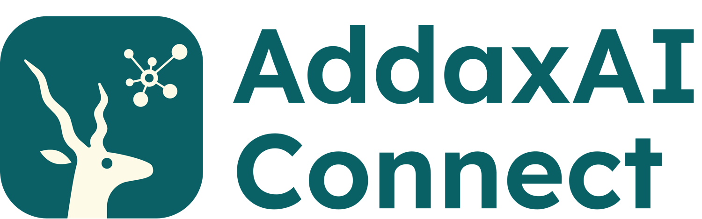

  

 

<h3>
  
Official documentation: https://petervanlunteren.github.io/AddaxAI-Connect/

</h3>

 

<picture>
  <source media="(prefers-color-scheme: dark)" srcset="https://github.com/user-attachments/assets/76e0415d-956c-4c5c-8d72-ed4bae09da6d" />
  
</picture>

 

AddaxAI Connect is an open-source platform that automatically processes camera trap images with machine learning. It picks up images from your cameras via FTPS, figures out what's in them, and shows you everything in a web interface with maps, charts, and notifications. Fully self-hosted on a single server, so your data stays yours. Deploy it, point your cameras at it, and go do something more fun than manually sorting thousands of photos of empty bushes.

AddaxAI Connect is made for nature conservation. The software is free and open source, with no licensing cost, and it stays that way. We build it so that parks, reserves, and research teams can run their own camera trap pipeline without paying for software. The goal is to protect nature, not to make money from the software. If you would rather not run it yourself, we also offer to deploy it or host it for you as a paid service. That paid help is what keeps the software free for everyone.

A collaboration between [Addax Data Science](https://addaxdatascience.com) and [Smart Parks](https://www.smartparks.org). Built on [AddaxAI](https://github.com/PetervanLunteren/addaxai) for the ML backbone.

## Demo

Try it yourself: [demo.addaxai.com](https://demo.addaxai.com/login)

## How it works

Your camera uploads an image via FTPS. From there, AddaxAI Connect handles the pipeline automatically:

1. **Ingestion** validates the file, reads GPS and timestamp from the metadata, stores it
2. **Detection** with [MegaDetector v1000 Redwood](https://github.com/agentmorris/MegaDetector) finds animals, people, and vehicles
3. **Classification** identifies the species using [DeepFaune](https://www.deepfaune.cnrs.fr/) or [SpeciesNet](https://github.com/google/speciesnet). Need another model? [Open an issue!](https://github.com/PetervanLunteren/AddaxAI-Connect/issues)
4. **Notifications** via email and Telegram: instant alerts, daily/weekly/monthly reports, battery warnings, etc
5. **Web interface** lets you browse results, view them on a map, check stats, and export data

Each step runs as its own Docker service. They pass messages through Redis queues, store images in MinIO, and share a PostgreSQL database. It supports multiple projects with role-based access control, so different teams can work from the same server. For the full breakdown, see the [architecture](https://petervanlunteren.github.io/AddaxAI-Connect/architecture/).

## Camera compatibility

AddaxAI Connect works with any camera trap that can upload images via FTPS. Each camera model needs a camera profile, a small piece of code that tells the system how to extract the camera ID, GPS coordinates, and timestamp from that model's images. Profiles can pull these from EXIF, from the upload directory path, etc. As long as it is somewhere. 

Adding a new camera usually takes a bit of development and testing. If your camera isn't listed, [open an issue](https://github.com/PetervanLunteren/AddaxAI-Connect/issues) with a few sample images and we'll work it out. See [camera requirements](https://petervanlunteren.github.io/AddaxAI-Connect/camera-requirements/) for the full details and list of supported cameras.

## Getting started

You need an Ubuntu server and a domain name. Deployment is automated with Ansible: fill in a config file, run a command, and you're up and running in about an hour. See the [documentation](https://petervanlunteren.github.io/AddaxAI-Connect/) for camera requirements, step-by-step deployment, and setup instructions.

For contributors: [developer docs](DEVELOPERS.md) and [conventions](CONVENTIONS.md).

## Hosted service

Not every team has the technical capacity to run a server. For those teams, Smart Parks and Addax Data Science offer AddaxAI Connect as a hosted service, always together. They deploy it, keep it running, and help you connect your cameras, so you can spend your time on the wildlife instead of the infrastructure. This part is a paid service, and it is what keeps the open software free for everyone.

The service is practical and mission-driven. It is best-effort and kept lightweight, without formal service level agreements or heavy procurement. If your organisation needs enterprise-level guarantees or contractual service levels, you can deploy the open-source stack yourself or work with a specialised enterprise provider.

To talk about hosting or setup help, visit [plan.addaxai.com](https://plan.addaxai.com).

<!--
AddaxAI Connect is being developed by Smart Parks and Addax Data Science as an open and accessible software stack, made available via GitHub so that organisations can deploy, adapt, and contribute to it themselves. In addition, Smart Parks formally offers AddaxAI Connect as a hosted service, always together with Addax Data Science, for organisations that do not have the technical capacity to deploy or maintain the solution independently. This service is offered on a best-effort basis, with the intention of making the technology easier to access and use. It is not positioned as an enterprise-grade managed service with formal SLAs, dedicated support contracts, or complex procurement and compliance processes. That does not mean the solution is not designed responsibly, securely, or professionally, but rather that Smart Parks and Addax Data Science aim to keep the offering lightweight, practical, and mission-driven. Organisations requiring enterprise-level guarantees, contractual service levels, or extensive vendor processes are encouraged to deploy the open-source stack themselves or work with a specialised enterprise service provider.
-->

## Hardware

The system requires hardware to operate. You will need cameras, SIM cards, and a server. If you need help sourcing hardware, visit [plan.addaxai.com](https://plan.addaxai.com).

## License

[MIT](LICENSE)
